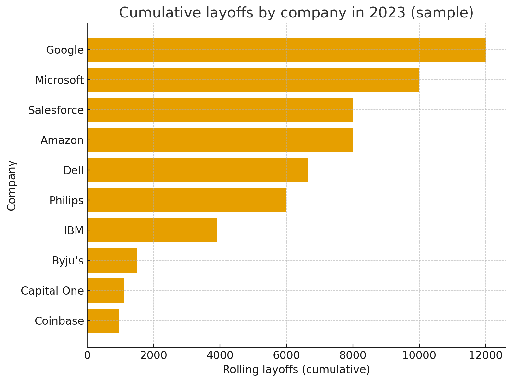

# 📉 Data Cleaning in SQL: Layoffs Dataset

## 📝 Introduction

This project focuses on **cleaning and analyzing** a sample layoffs dataset from Dec 2022 - March 6, 2023, using SQL.
My approach to my workflow was as follows:

1. Clean the raw dataset (remove duplicates, standardize fields, fix NULLs, convert data types).
2. Perform Exploratory Data Analysis (EDA) to uncover patterns, trends, and insights contained within the cleaned data.

Cleaning always comes first — without reliable, standardized, and trustworthy data, any analysis afterwards becomes misleading. This project highlights that full process from raw → clean → insights.

## 🏁 Background

The layoffs dataset contains information on company layoffs, industries, dates, funding, and more.
However, like many real-world datasets, it includes:

- duplicates
- inconsistent formatting
- NULL/blank values
- incorrect data types
- inconsistent categories

My first goal was to fully clean the dataset in a structured, repeatable way.
Once the data was reliable, I conducted an exploratory analysis to answer questions such as:

- Which companies had the largest count of layoffs?
- Which companies had the largest layoffs as a percentage of their workforce?
- What industries were impacted the most?
- How did layoffs evolve month-to-month?

This project walks through the exact SQL steps needed to clean the layoffs dataset and perform EDA.
To avoid altering the original data, I use staging tables, window functions, string functions, self-joins, and column transformations.

## 🛠️ Tools I Used

This entire project was built using:

- **SQL**: The backbone of my data cleaning, allowing me to query and modify the database. Critical in unearthing uncleansed data and performing EDA.
- **MySQL**: The chosen database management system. Ideal for data previewing, schema exploration, and testing cleaning logic.
- **MySQL Workbench**: Used for writing and executing SQL scripts.
- **Git & GitHub**: Essential for version control and sharing my SQL scripts and data cleaning process, ensuring collaboration and project tracking.

## 🧼 Part 1 — Data Cleaning Workflow

After importing the raw layoffs dataset into MySQL, I created staging tables to avoid modifying the original dataset.

### 1. Remove Duplicates

Because MySQL does not allow deleting from a CTE directly, I used a staging table:

- Created layoffs_staging as a copy of the raw dataset
- Generated a row_num column using ROW_NUMBER() window function
- Inserted everything into a further staging table, layoffs_staging2
- Deleted rows where row_num > 1

**Key Query Snippet**:

```sql
WITH duplicate_cte AS (
	SELECT
		*,
		ROW_NUMBER() OVER (PARTITION BY company, location, industry, total_laid_off, percentage_laid_off, `date`, stage, country, funds_raised_millions) AS row_num
	FROM layoffs_staging
)
SELECT *
FROM duplicate_cte
WHERE row_num > 1;

CREATE TABLE `layoffs_staging2` (
  `company` text,
  `location` text,
  `industry` text,
  `total_laid_off` int DEFAULT NULL,
  `percentage_laid_off` text,
  `date` text,
  `stage` text,
  `country` text,
  `funds_raised_millions` int DEFAULT NULL,
  `row_num` int -- we added this one so we can filter on this and delete the necessary rows.
) ENGINE=InnoDB DEFAULT CHARSET=utf8mb4 COLLATE=utf8mb4_0900_ai_ci;

INSERT INTO layoffs_staging2
SELECT
	*,
	ROW_NUMBER() OVER (PARTITION BY company, location, industry, total_laid_off, percentage_laid_off, `date`, stage, country, funds_raised_millions) AS row_num
FROM layoffs_staging;

DELETE
FROM layoffs_staging2
WHERE row_num > 1;
```

### 2. Standardize & Clean Text Columns

**Actions included**:

- TRIM() company names
- Normalize industry names (CryptoCurrency → Crypto)
- Remove trailing punctuation in country names
- Convert date strings using STR_TO_DATE()
- Alter column metadata from TEXT → DATE

**Example**:

```sql
UPDATE layoffs_staging2
SET country = TRIM(TRAILING '.' FROM country)
WHERE country LIKE 'United States%';
```

### 3. Handling NULL and Blank Values

- Identified NULL rows in important columns
- Used a self-join to populate missing industry values
- Converted blank strings to NULL for consistency

**Key Query**:

```sql
UPDATE layoffs_staging2 t1
JOIN layoffs_staging2 t2
  ON t1.company = t2.company
SET t1.industry = t2.industry
WHERE t1.industry IS NULL
AND  t2.industry IS NOT NULL;
```

### 4. Delete Irrelevant Rows / Columns

Rows with no layoff information were removed:

```sql
DELETE FROM layoffs_staging2
WHERE total_laid_off IS NULL
  AND percentage_laid_off IS NULL;
```

Temporary columns like row_num were dropped because they were used in the staging table to delete duplicate rows.

## 📊 Part 2 — Exploratory Data Analysis (EDA)

Once the dataset was fully cleaned, I performed an exploratory analysis to uncover trends and insights.

Below is a summary of some of the main EDA queries and what they reveal.

- Which companies had the largest count of layoffs?
- Which companies had the largest layoffs as a percentage of their workforce?
-
- How did layoffs evolve month-to-month?

### 1. Which companies had the largest count of layoffs?

To identify the companies with the largest count of layoffs, I used an aggregate SUM function to get the total layoffs and GROUP BY to focus on the company. This query highlights the total count of layoffs.

```sql
SELECT company, SUM(total_laid_off) as total_layoffs
FROM layoffs_staging2
GROUP BY company
ORDER BY total_layoffs DESC;
```

The visualization shows the companies with the most layoffs (in terms of count) for the sample dataset:



### 2. Which companies had the largest layoffs as a percentage of their workforce?

These companies reported percentage_laid_off = 1, meaning they laid off their entire workforce. Often a sign of shutdown, bankruptcy, or acquisition.

```sql
SELECT *
FROM layoffs_staging2
WHERE percentage_laid_off = 1
ORDER BY total_laid_off DESC;
```

## Companies That Laid Off 100% of Their Workforce

| Company       | Location      | Industry       | Total Laid Off | Date       | Stage    | Country        | Funds Raised (M) |
| ------------- | ------------- | -------------- | -------------- | ---------- | -------- | -------------- | ---------------- |
| Britishvolt   | London        | Transportation | 206            | 2023-01-17 | Unknown  | United Kingdom | 2400             |
| EMX Digital   | New York City | Marketing      | 100            | 2023-02-13 | Unknown  | United States  | null             |
| Openpay       | Melbourne     | Finance        | 83             | 2023-02-07 | Post-IPO | Australia      | 299              |
| Arch Oncology | Brisbane      | Healthcare     | null           | 2023-01-13 | Series C | United States  | 155              |
| Brodmann17    | Tel Aviv      | Other          | null           | 2022-12-09 | Series A | Israel         | 25               |
| Digital Surge | Brisbane      | Crypto         | null           | 2022-12-09 | Unknown  | Australia      | null             |
| DUX Education | Bengaluru     | Education      | null           | 2023-02-28 | Unknown  | India          | null             |
| Earth Rides   | Nashville     | Transportation | null           | 2023-01-19 | Unknown  | United States  | 2                |
| Fipola        | Chennai       | Food           | null           | 2023-02-20 | Series A | United States  | 9                |
| Kandela       | Los Angeles   | Consumer       | null           | 2023-03-02 | Acquired | United States  | null             |
| Lantern       | Grand Rapids  | Retail         | null           | 2023-01-06 | Seed     | United States  | 40               |
| Locomation    | Pittsburgh    | Transportation | null           | 2023-02-22 | Seed     | United States  | 57               |

Here's a quick breakdown into what I think could lead to these companies laying off one hundred percent of their workforce:

- bankruptcy, complete shutdown, or failed funding rounds. Britishvolt, for example, declared insolvency.
- Many belong to distressed sectors (Crypto, Transportation, Healthcare). These sectors are known for high burn rates.

### 3. What were the top 5 most impacted industries?

```sql
SELECT
    industry,
    SUM(total_laid_off) as total_layoffs
FROM layoffs_staging2
GROUP BY industry
ORDER BY total_layoffs DESC
LIMIT 5;
```

## Total Layoffs by Industry

| Industry   | Total Layoffs |
| ---------- | ------------- |
| Other      | 28,767        |
| Consumer   | 16,518        |
| Retail     | 14,202        |
| Hardware   | 13,577        |
| Healthcare | 10,054        |

#### 🔍 Key Insights

- **"Other" industries lead layoffs** with over **28,000 jobs lost**, suggesting many smaller or niche sectors were disproportionately impacted.
- **Consumer and Retail** layoffs are also high, likely reflecting shifting spending habits and economic pressure on consumer-facing companies.
- **Hardware and Healthcare**—typically more stable sectors—still show significant cuts, indicating broad market-wide challenges rather than isolated issues.
- Overall, the data reflects a **widespread contraction across diverse industries**, not limited to tech or high-growth startups.

### 4.

## Monthly Layoffs (Dec 2022 – Mar 2023)

```sql
SELECT
    SUBSTRING(date, 1,7) AS months,
    SUM(total_laid_off) as monthly_layoffs
FROM layoffs_staging2
GROUP BY months
ORDER BY months;
```

| Month   | Monthly Layoffs |
| ------- | --------------- |
| 2022-12 | 8,633           |
| 2023-01 | 84,714          |
| 2023-02 | 36,493          |
| 2023-03 | 4,470           |

#### 🔍 Key Insights for this sample dataset

- **January 2023 experienced an extreme spike** with over **84,000 layoffs**, the highest in this period by a wide margin—likely driven by major tech layoffs (Google, Microsoft, Amazon, Salesforce).
- **February 2023 saw a sharp decline**, falling to around **36,000**, indicating the peak layoff wave began cooling off.
- **March 2023 dropped even further** to fewer than **5,000 layoffs**, but the data was incomplete so it is not certain what the trend would have been.
- **December 2022’s layoffs were comparatively low**, showing that the large-scale cuts were highly concentrated around early 2023.

## 📘 What I Learned

This project reinforced several valuable SQL data engineering concepts:

- The importance of staging tables
- How to safely clean data using staging tables
- How to remove duplicates using window functions in MySQL
- How to normalize categorical data using string functions
- How to handle NULL vs. empty string inconsistencies
- How to convert messy string dates into proper DATE formats
- How to use self-joins to enrich missing data
- How to think like a data engineer when preparing data for analysis
- How to build meaningful EDA queries
- How to use window functions for ranking and rolling totals
- How to interpret workforce trends using SQL

## Conclusion

By the end of the first part of this project, the original messy dataset was transformed into:

- A clean, analysis-ready table
- Consistent formats
- Standardized categories
- Reliable text fields
- Validated date formats
- No duplicates
- Only relevant rows

After cleaning and analyzing the dataset, I gained insights into:

- which companies and industries were hit hardest

- how layoffs evolved over time

- how layoffs accumulated month-to-month

## Closing Thoughts

This project helped me understand how important reproducible cleaning workflows are in SQL, and it helped stengthen my SQL foundations.
Every decision, whether to delete, transform, enrich, query, or analyze data needs to be logical and documented.

Data cleaning and EDA projects like this one are invaluable for roles in data engineering and data analytics.

🔗 Feel free to explore the SQL script, clone the repo, or reach out with questions!
